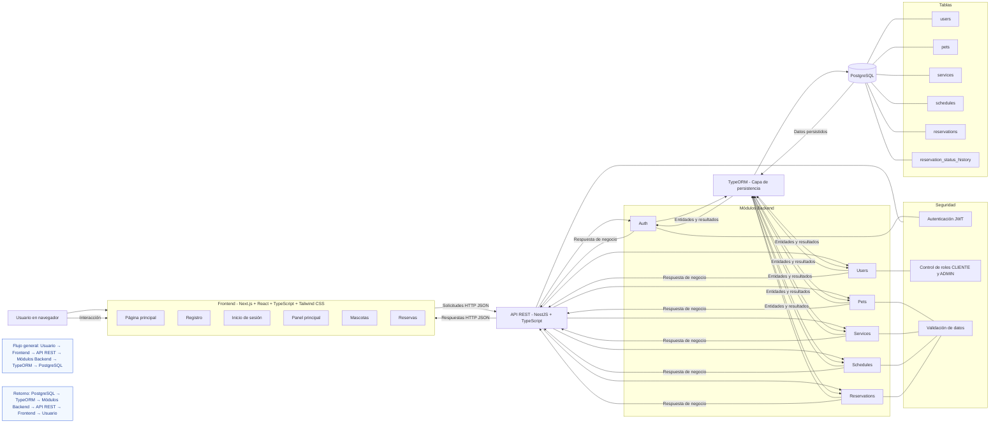

# Arquitectura detallada de Perriturno

Perriturno implementa una arquitectura cliente-servidor donde el usuario interactúa desde el navegador con una aplicación frontend desarrollada en Next.js. El frontend consume una API REST construida con NestJS mediante solicitudes HTTP y respuestas en formato JSON. El backend organiza la lógica de negocio en módulos, aplica autenticación y autorización con JWT y roles, valida los datos de entrada, y persiste la información con TypeORM sobre PostgreSQL.

